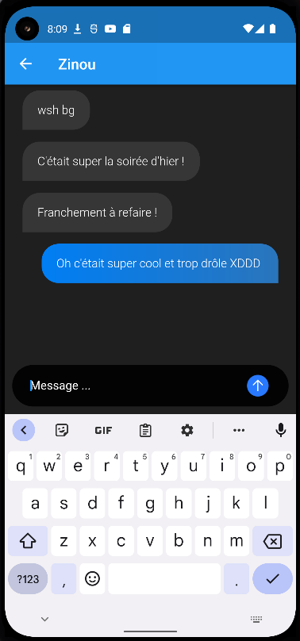
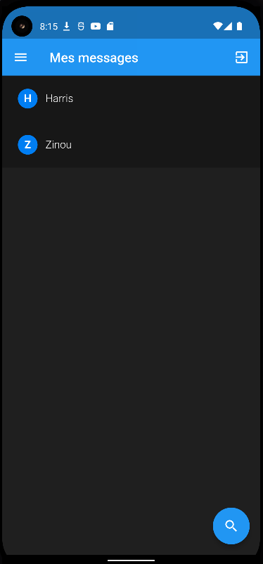
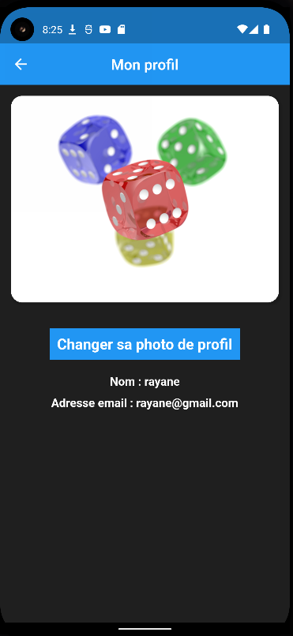

# WhatsUp - Application de messagerie

WhatsUp is the new chat application of the moment ! 
Communicate with your friends, share funny moments...

 
## Get started

You have, in  the root project :
 - launch the terminal and type :
	 -  `flutter pub get`
	 -  `flutter run` to launch the programm

If you have android studio or Xcode, the depedencies will be installed automatically.

## With WhatsUp, what we can do ?

Communicate with their friends, consult their profile... WhatsUp is the application of the moment

## How it work ?

It's very simple, you just have to connect, select the contact with whom you want to communicate.
Then write your message then click on the icon to the right of the message bar to send your message. Your message will then be sent to the chosen contact instantly.

## Log in
 
To communicate with your contacts you will need to create a profile and log in. To create your profile, you will need to click on your profile and enter an email address and a password. You can also add a profile photo that you can change later.

